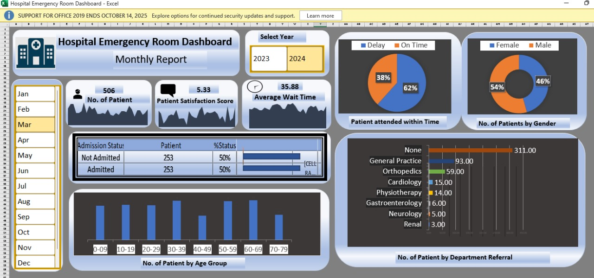
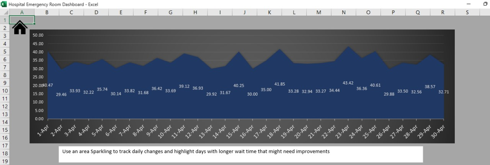
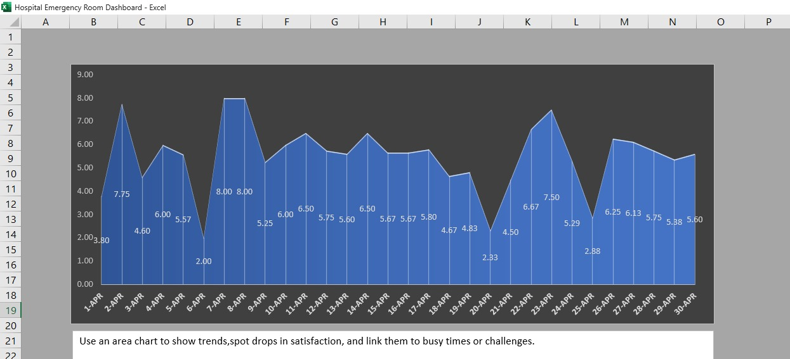
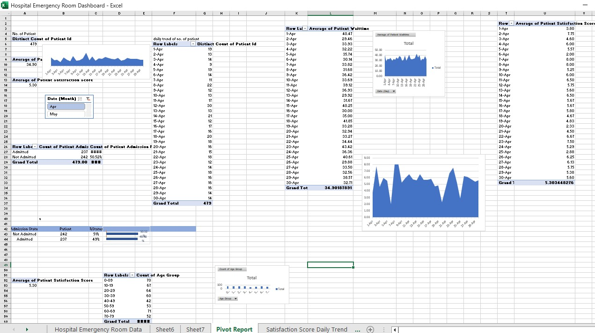
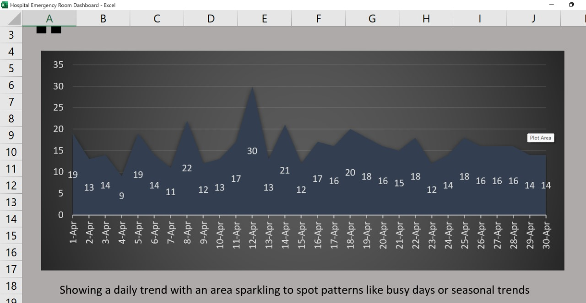
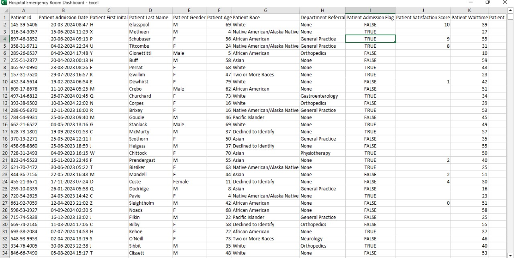
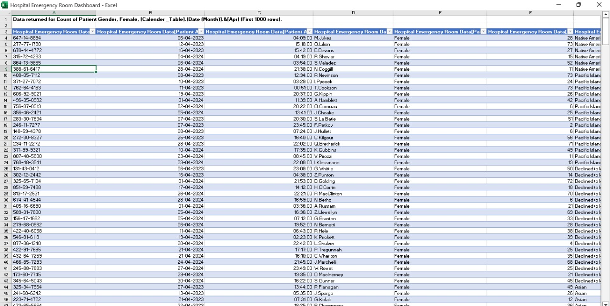

# Hospital-ER-Dashboard
Cleaned and standardized 9,000+ hospital emergency room records (fixed inconsistent gender labels, handled missing values, normalized referral sources) to ensure data accuracy and reliability before building the interactive Excel dashboard

# Hospital Emergency Room Dashboard

An interactive Excel dashboard built to analyze **9,000+ hospital emergency room records** — covering patient wait times, satisfaction scores, admission rates, and referral sources.  
This dashboard helps hospital staff monitor operations, reduce wait times, and improve patient satisfaction.

---

## Key Insights
- **Average wait time:** ~35 minutes  
- **Satisfaction scores:** ~5/10 (2.5k records available)  
- **Admission status:** Clear split between Admitted / Not Admitted  
- **Top referral sources:** General Practice, Orthopedics, Physiotherapy  

---

## Screenshots

### Dashboard Overview  

### Average Wait Time  

### Patient Satisfaction  

### Admissions & Pivots  

### Patient Tracking  

### ER Data View  

### Image ER  

---

## Files in Repository
- **Hospital Emergency Room Dashboard..xlsx** → Main Excel Dashboard  
- **README.md** → Project Documentation  
- **DASHBOARD.jpg** → Dashboard Screenshot  
- **Average waitime overview.jpg** → Wait Time Chart  
- **patient satisfaction score overview.jpg** → Satisfaction Score Chart  
- **PIVOTS.jpg** → Pivot Analysis  
- **no. of patients track.jpg** → Patient Tracking Chart  
- **ER DATA.jpg** → Cleaned Data Preview  
- **IMAGE.ER.jpg** → Supporting Dashboard Visual  

---

## How to Use
1. Download or clone this repository.  
2. Open `Hospital Emergency Room Dashboard..xlsx` in Excel.  
3. Refresh all data to update charts and pivots.  
4. Use the slicers and filters to explore metrics.

---

## Tools Used
- **Excel**: Pivot Tables, Charts, Slicers, Conditional Formatting  
- **Data Cleaning**: Standardized gender, handled missing values, normalized referral sources  
- **Data Analysis**: KPIs, admissions, satisfaction scores, wait time insights  

---

## License
Open-source under the MIT License — free to use with credit.

